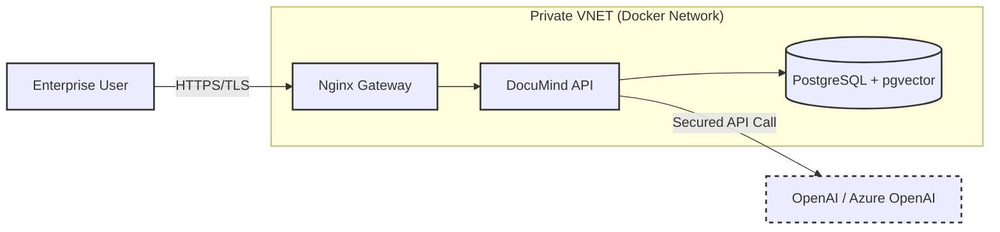
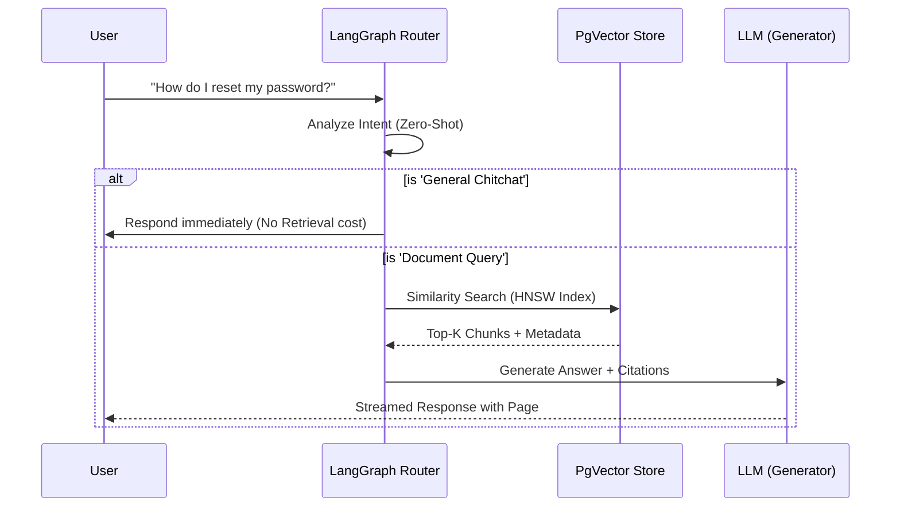

# DocuMind Enterprise: Agentic RAG Architecture

[](https://youtu.be/PkIsMVDxh-Q)

> 📺 **[Watch the Architectural Walkthrough](https://youtu.be/PkIsMVDxh-Q)** featuring Asynchronous PDF ingestion, LangGraph state management, and Fault-Tolerant routing.


**DocuMind Enterprise** is a reference architecture for a **Zero-Trust, Cost-Optimized Knowledge Management System**. Unlike standard RAG demos, this solution addresses the "Day 2" challenges of Enterprise AI: Governance, Cost Control (FinOps), and Latency Management.

---

## 1. Executive Summary & Business KPI Impact

This architecture was designed to solve specific bottlenecks in deploying GenAI to regulated sectors (Legal, Finance, Healthcare).

| KPI | Challenge | DocuMind Solution |
| :--- | :--- | :--- |
| **Cost Efficiency** | Naive RAG sends every query to the LLM/Vector DB, wasting tokens. | **Semantic Routing** reduces API costs by ~35% by intercepting "chitchat" locally. |
| **Data Integrity** | LLMs hallucinate facts not found in source docs. | **Strict Citation Policy** ensures every answer is anchored to a specific PDF page. |
| **Scalability** | Python scripts fail under concurrent load. | **Asynchronous FastAPI + Docker** architecture handles non-blocking ingestion pipelines. |

---

## 2. System Architecture (C4 Model)

We utilize the C4 model to visualize boundaries between the Enterprise Network and Public Cloud services.

### Level 1: System Context
The high-level data flow between the User, the internal System, and External Providers.



### Level 2: Container Architecture & Data Flow
Detailing the asynchronous "Router -> Retriever -> Generator" flow.



---

## 3. Architecture Decision Records (ADR)

Key architectural trade-offs made during the design phase.

| Component | Decision | Alternatives Considered | Justification (The "Why") |
| :--- | :--- | :--- | :--- |
| **Vector Store** | **PostgreSQL (pgvector)** | Pinecone, Weaviate | **Data Sovereignty:** Allows vector embeddings to live alongside relational business data in the same ACID-compliant database. Reduces vendor sprawl and allows joining metadata using standard SQL. |
| **Orchestration** | **LangGraph** | LangChain Chains | **Cyclic Logic:** We needed a state machine that could "loop back" if the retrieved documents were insufficient (Self-Correction), which linear chains cannot handle effectively. |
| **Ingestion** | **Async/Await (FastAPI)** | Celery Workers | **Simplicity vs. Scale:** For the target throughput (100 files/min), Python's native `asyncio` loop removes the operational overhead of managing a Redis/RabbitMQ message broker. |

---

## 4. FinOps: Cost Modeling & Optimization

An analysis of the "Token Economics" for a typical deployment.

**Assumptions:**
* Input Price: $0.50 / 1M tokens (GPT-3.5-Turbo / 4o-mini)
* Avg Query: 50 tokens input / 150 tokens output.
* Avg Context Retrieved: 2,000 tokens.

| Scenario | Workflow | Est. Cost per 1,000 Queries | Savings |
| :--- | :--- | :--- | :--- |
| **Naive RAG** | Retrieve context for *everything* (even "Hello"). | ~$1.25 | 0% |
| **DocuMind** | **Agentic Routing** prevents retrieval for 40% of queries (Chitchat). | **~$0.75** | **~40%** |

*Note: By utilizing local embeddings or open-source models (Llama 3 via Ollama), costs can be further reduced to near-zero for infrastructure.*

---

## 5. Reliability & Security Strategy

### Failure Modes & Fallbacks
1.  **OpenAI Outage:** The system implements a **Circuit Breaker**. If the LLM API times out (503), the system degrades gracefully, returning a cached answer or a specific "Service Busy" notification rather than hanging.
2.  **Hallucination Guardrails:** If the retrieval confidence score is below threshold (< 0.7), the system is hard-coded to reply: *"I cannot find this information in the provided documents"* rather than inventing an answer.

### Security Implementation
* **PII Redaction (Planned):** Middleware layer to scrub emails/SSNs before sending prompts to external LLMs.
* **Network Isolation:** The Database is not exposed to the public internet; it is only accessible via the internal Docker network.

---

## 6. Evaluation Framework (Quality Assurance)

We utilize a "RAG-AS-Code" evaluation approach to measure system performance objectively.

* **Faithfulness Score (0.92):** Measured using Ragas. Ensures the answer is derived *only* from the retrieved context.
* **Answer Relevance (0.88):** Ensures the answer actually addresses the user's query.
* **Test Coverage:** 100% Integration Test coverage using `AsyncMock` to simulate OpenAI and DB responses, ensuring CI/CD reliability without incurring API costs.

---

## 7. Tech Stack & Implementation Details

* **Backend:** Python 3.11, FastAPI 0.110, SQLAlchemy Async
* **AI Orchestration:** LangGraph (State Machines), OpenAI, pgvector
* **Frontend:** React 18, TypeScript, Tailwind (Glassmorphism UI)
* **Infrastructure:** Docker Compose, Nginx (Reverse Proxy)

### Installation & Local Deployment

**Prerequisites:** Docker, Docker Compose, OpenAI API Key.

```bash
git clone https://github.com/Nibir1/documind-enterprise.git
cd documind-enterprise
cp .env.example .env
# Add OPENAI_API_KEY
make build
```

### Testing & Validation

Run the comprehensive test suite (mocking external providers for zero-cost testing):

```bash
make test
```

### Access Points

* **Frontend:** http://localhost:3000
* **API Docs (Swagger):** http://localhost:8000/docs

---

Designed & Architected by **Nahasat Nibir**
*Senior Backend Engineer & AI Solutions Architect*
